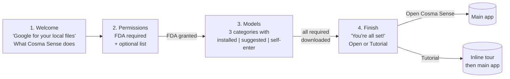
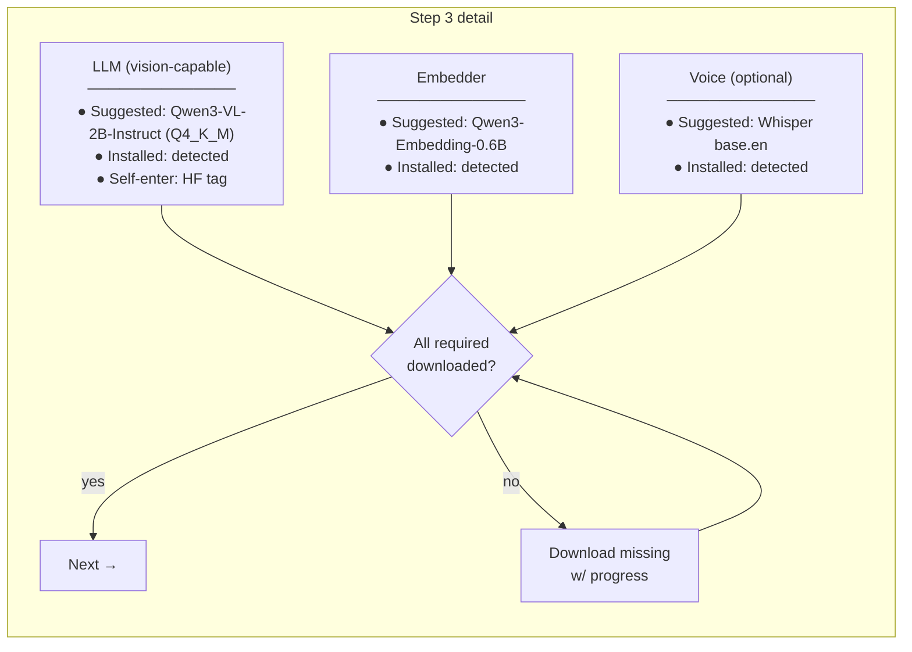

# Setup-wizard redesign

Spec for the 4-step onboarding flow proposed 2026-05-04. Not yet
implemented — current `SetupWizardView.swift` still uses the old
4-step flow (Full Disk Access → Shortcut → AI Model → Backend).

## Flow

## Step 1 — Welcome

- Header: `Hi! 👋 welcome to Cosma Sense`
- Body: a short paragraph — "A local file search engine. Google for
  your Mac. Search by name, content, and meaning, all without
  sending your files to the cloud."
- Footer: single `Continue` button.

## Step 2 — Permissions

- Header: "First we need some permissions."
- **Required (must be granted to Continue):**
  - Full Disk Access — enables indexing your files. Existing UI
    reused (deep-link to System Settings + re-check).
- **Optional (check to enable, can skip):**
  - Notifications — heads-up when long indexing jobs complete.
  - Accessibility — required for the global Quick Search hotkey
    if not set via the System Settings keyboard shortcut.
  - Screen Recording (optional, future) — if/when "describe
    current window" feature lands.
- Footer: `Continue` enabled iff FDA granted.

## Step 3 — Models

Three model categories, each rendered as a card. Each card has:

- A **toggle/disclosure** that expands to show a short description of
  what the model does ("LLM: writes a 1-line summary of each file
  for the search index").
- A **dropdown** with three sections:
  - **Installed** — auto-detected from Ollama / HF cache / cosma's
    model dir. Shown first.
  - **Suggested** — curated list (Qwen3-VL-2B, etc.). Bench results
    feed this list — tested winners only.
  - **Self-enter** — text field accepting an HF repo or Ollama tag.
    Validated on download attempt.
- A **status row** showing whether the chosen model is downloaded.
  If not, "Download" button → progress bar.

Default selection per category:
- If at least one option is "installed" → that one.
- Else → top of the suggested list.

`Next` is enabled iff every required category has its chosen model
downloaded. ("Required" = LLM + Embedder for now; Voice optional.)

## Step 4 — Finish

- Header: "🎉 You're all set!"
- Body: 1-line about what to do next.
- Two actions:
  - **Open Cosma Sense** (primary, highlighted)
  - **Start Tutorial** (secondary — runs an inline tour highlighting
    the search box, the @-folder scope token, settings)

## Backend changes required

Mostly minimal because the **Phase 1 picker only lists models the
backend already supports**. Exact list comes from the bench's
"suggested" set, which today is one model per category.

Things that DO need a small backend change:

- **`GET /api/models/installed`** — return a map of
  `{category: [installed_model_ids]}` by introspecting Ollama, the
  HF hub cache, and cosma's model dir. Lets the wizard detect
  "already there" without guessing.
- **`POST /api/models/install`** — accept `{category, model_id}` and
  trigger the existing bootstrap path. Today's bootstrap is
  hardcoded to per-provider defaults; this generalizes it.

These can be deferred — Phase 1 can ship without `/api/models/*` if
we keep the suggested list to one model per category.

## Connection to the bench

The "suggested" lists in step 3 come straight from the bench in
[`cosmasense/vlm-bench`](https://github.com/cosmasense/vlm-bench).
A model gets in only if it passes the lightbulb canary (no
filename-driven hallucination on `bullet.png`) and stays competitive
on the OCR-heavy screenshots. As of the v3 bench, that's:
- LLM: Qwen3-VL-2B-Instruct only (until Path A unblocks Qwen3.5).
- Embedder: Qwen3-Embedding-0.6B only.
- Voice: Whisper base.en (no bench yet — quality is ~not in scope).

## Order of work

1. **Phase 1** — flow + step UI, suggested = one model per
   category. No backend changes. Ship in the next frontend release.
2. **Phase 2** — `/api/models/installed` + `/api/models/install`,
   self-enter validation, real install detection.
3. **Phase 3** — Qwen3.5 added to the LLM suggested list once
   `Path A` lands (`Qwen35VLChatHandler` in the fork).
